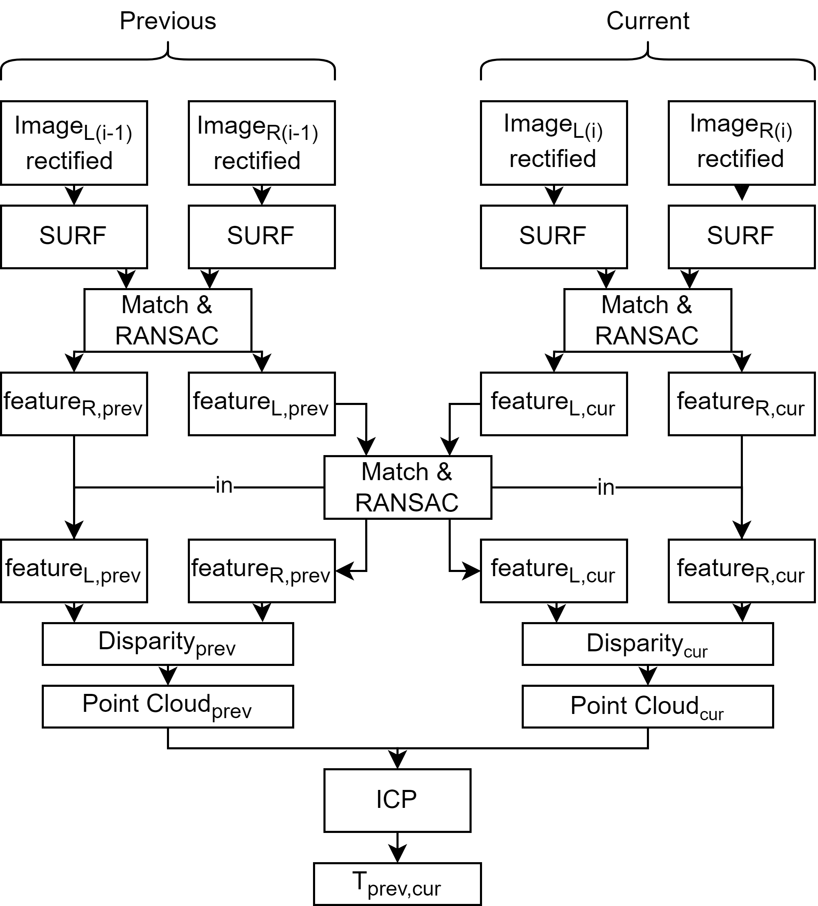
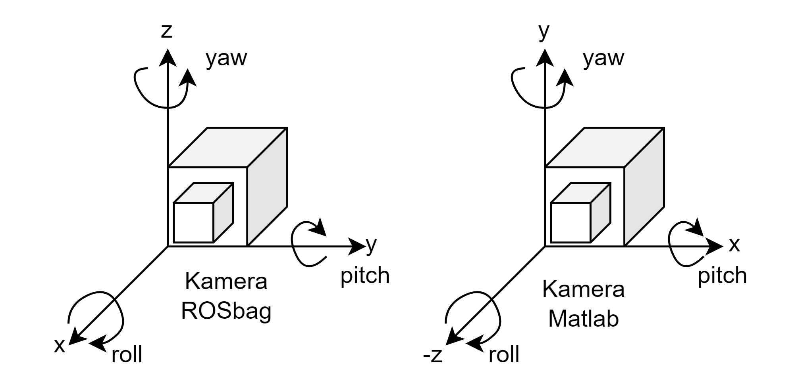

# Stereo visual odometry
## General Informations
- The scripts in this repository can be used to calculate and plot the trajectory based on stereo-camera images in matlab.
- The Iterative Closest Point Algorithm is used to calculate the transformation between previous and current frames

## Algorithm Sparse Visual Odometry

- [rectifyStereoImages](https://de.mathworks.com/help/vision/ref/rectifystereoimages.html)
- [detectSURFFeatures](https://de.mathworks.com/help/vision/ref/detectsurffeatures.html)
- [matchFeatures](https://de.mathworks.com/help/vision/ref/matchfeatures.html)
- [Random sampling and consensus/ransac](https://www.petercorke.com/MVTB/r3/html/ransac.html)
- [Iterative Closest Point Algorithm/ICP](https://de.mathworks.com/help/vision/ref/pcregistericp.html)

## Hardware
- [NVIDIA JetsonNano withROS](https://developer.nvidia.com/embedded/jetson-nano-developer-kit)
- [ZED Stereo Camera from Stereolabs](https://www.stereolabs.com/docs)
     -   [Calibration File](https://support.stereolabs.com/hc/en-us/articles/360007497173-What-is-the-calibration-file)

## Used Matlab Toolbox
Download and install the matlab [RVC](https://petercorke.com/toolboxes/robotics-toolbox/) toolboxes (RVC 2017) "Robotics Toolbox for Matlab" and "Machine Vision Toolbox for Matlab" from Peter Corke.

>[!NOTE]
>In Matlab: Move the Toolbox via Set Path to the top

## Given Data
- The rosbag `testdrive_2022-10-25-09-01-50.bag` can be used to extract stereo images and the ground truth trajectory as well as the values for dense stereo-visual-odometry.
- The conf file [SN10028708.conf](https://support.stereolabs.com/hc/en-us/articles/360007497173-What-is-the-calibration-file) contains the important 
camera configurations. The images in the bag belong to the HD configurations.
>[!NOTE]
>Be aware of the camera coordinate system in the rosbag and in matlab
>

## Scripts
- Use `ICP_dense.mat` to calculate transformation matrices between the frames with sparse stereo
- Use `ICP_sparse.mat` to calculate transformation matrices between the frames with dense stereo
- Use `plot_results.icp.mat` to plot the computed trajectory from `ICP_dense.mat` or `ICP_sparse.mat` together with the ground truth trajectory.

### helper Functions
- `calc_intrinsic_camera_matrix.m`: Calcualtes intrinsic camera matrix from camera configuration.
- `calc_transformation_K12.m`: Calculates transformation matrix (translation in m, rotation in Rodrigues notation)
- `createStereoParams.m`: Converts intrinsics and stereo pose to matlab stereoParams.
- `calc_triangulation_parameters`: Calculates the parameters for triangulation based on the reprojection matrix which is returned by [rectifyStereoImages](https://de.mathworks.com/help/vision/ref/rectifystereoimages.html)
  
- `plot_features.m`: Plots the features as red squares of size win_size in the current figure.
- `plot_matches.m`: Plots the result of feature matching in the current figure.
  
- `remove_points_near_the_border.m`: Removes points near the edge where distortion could not be handled as well as in the center.
- `remove_unvalid_features.m`: Removes not inlier indices of unlimited number of [feature points](https://de.mathworks.com/help/vision/feature-detection-and-extraction.html)
- `load_camera_config.m`: Loads the ZED camera config file (here SN10028708.conf)

