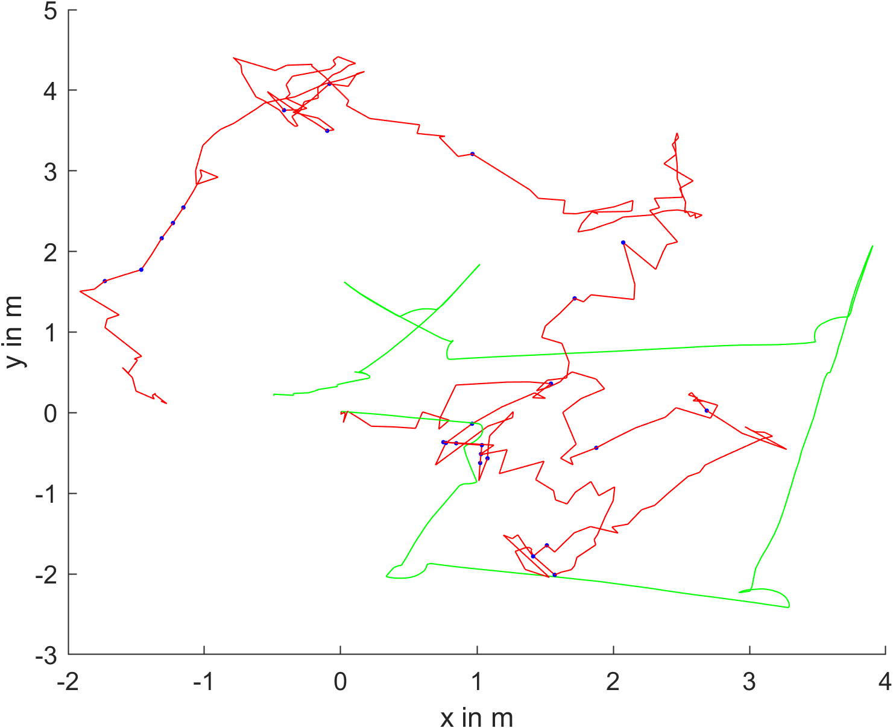

# Stereo visual odometry
## General Informations
- link to repository: https://github.com/mahof018/stereo-visual-odometry.git
- The scripts in this repository can be used to calculate and plot the trajectory based on stereo-camera images in matlab.
- The Iterative Closest Point Algorithm (ICP) is used to calculate the transformation between previous and current frames.
- You can adjust various thresholds in the scripts to look for better output based on your specific data.

## Algorithms used for sparse visual odometry

- [rectifyStereoImages](https://de.mathworks.com/help/vision/ref/rectifystereoimages.html)
- [detectSURFFeatures](https://de.mathworks.com/help/vision/ref/detectsurffeatures.html)
- [matchFeatures](https://de.mathworks.com/help/vision/ref/matchfeatures.html)
- [Random sampling and consensus/ransac](https://www.petercorke.com/MVTB/r3/html/ransac.html)
- [Iterative Closest Point Algorithm/ICP](https://de.mathworks.com/help/vision/ref/pcregistericp.html)

## Hardware
- [NVIDIA JetsonNano withROS](https://developer.nvidia.com/embedded/jetson-nano-developer-kit)
- [ZED Stereo Camera from Stereolabs](https://www.stereolabs.com/docs)
     -   [Calibration File](https://support.stereolabs.com/hc/en-us/articles/360007497173-What-is-the-calibration-file)

## Used Matlab Toolbox
Download and install the matlab [RVC](https://petercorke.com/toolboxes/robotics-toolbox/) toolboxes (RVC 2017) "Robotics Toolbox for Matlab" and "Machine Vision Toolbox for Matlab" from Peter Corke.

>[!NOTE]
>In Matlab: Move the Toolbox via **Set Path** to the top

## Given data
- The rosbag `shrink_version_testdrive_2022-10-25-09-01-50.bag` can be used to extract stereo images and the ground truth trajectory as well as the values for dense stereo-visual-odometry.
    - The entire rosbag `testdrive_2022-10-25-09-01-50.bag` will not be published.
    - The shrinked bag contains the first 1.5 seconds of the entire rosbag.
- The conf file [SN10028708.conf](https://support.stereolabs.com/hc/en-us/articles/360007497173-What-is-the-calibration-file) contains the important 
camera configurations.
     - The images in the bag belong to the HD configurations.
>[!NOTE]
>Be aware of the camera coordinate system in the rosbag and in matlab.
>

## Scripts
**ICP**
- Use `ICP_dense.m` to calculate transformation matrices between the frames with sparse stereo.
- Use `ICP_sparse.m` to calculate transformation matrices between the frames with dense stereo.
  
**Plot results**
- Use `plot_results_icp.m` to plot the computed trajectory from `ICP_dense.mat` or `ICP_sparse.mat` together with the ground truth trajectory.

### helper Functions
**load and convert camera parameters:**
- `load_camera_config.m`: Loads the ZED camera config file (here SN10028708.conf).
- `calc_intrinsic_camera_matrix.m`: Calcualtes intrinsic camera matrix from camera configuration.
- `calc_transformation_K12.m`: Calculates transformation matrix (translation in m, rotation in Rodrigues notation).
- `createStereoParams.m`: Converts intrinsics and stereo pose to matlab stereoParams.
- `calc_triangulation_parameters`: Calculates the parameters for triangulation based on the reprojection matrix which is returned by [rectifyStereoImages](https://de.mathworks.com/help/vision/ref/rectifystereoimages.html).
  
**filter features:**
- `remove_points_near_the_border.m`: Removes points near the edge where distortion could not be handled as well as in the center.
- `remove_unvalid_features.m`: Removes not inlier indices of unlimited number of [feature points](https://de.mathworks.com/help/vision/feature-detection-and-extraction.html).
  
**plot features** (not used in the Scripts, but helpfull):
- `plot_features.m`: Plots the features as red squares of size win_size in the current figure.
- `plot_matches.m`: Plots the result of feature matching in the current figure.

## results
  - The results are saved in the results folder.
         -`results/dense_icp_matlab.mat` icp transformation matrices between frames and indices of not calculated transformations (`ICP_dense.m`)
         -`results/sparse_icp_matlab.mat` icp transformation matrices between frames and indices of not calculated transformations (`ICP_sparse.m`)
  - The plots from plot_results_icp.m are also saved in the resutls folder.
### icp sparse
  
  
  Top view of the trajectory of the entire bag
  - green: Ground truth, red: calculated, blue: not calculated (transformation matrix previous frame)
### icp dense
  
  
   Top view of the trajectory of the entire bag
  - green: Ground truth, red: calculated, blue: not calculated (transformation matrix previous frame)

## Author
This repository is maintained by [Matthis Hofmann](https://github.com/mahof018).
